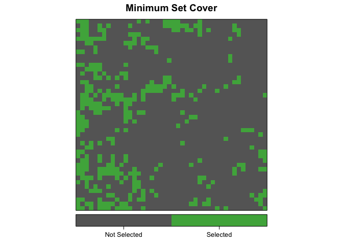

<!-- README.md is generated from README.Rmd. Please edit that file -->
Protected Area Design with Gurobi in R
======================================

**NOTE: This package is in development and requires further testing before I can be confident there are no bugs. If you use this package, or have any feature requests, please let me know by posting an Issue.**

The primary purpose of this package is to solve Marxan-like systematic reserve design problems using integer programming techniques as implemented by Gurobi. [Marxan](http://www.uq.edu.au/marxan/) is the most widely used systematic conservation planning software. It's used worldwide to design reserve networks that maximize conservation gains while minimizing socioeconomic cost. [Gurobi](http://www.gurobi.com/) is a powerful commercial optimization software that implements a variety of state-of-the-art algorithms for solving optimization problems. This R package can be used to solve the Marxan reserve design optimization problem using Gurobi.

In addition, this package contains a variety of functions to aid in setting up reserve design problems, such as defining regular grids of hexagonal planning units, calculating planning unit boundaries, and generating realistic species distributions. These functions may be valuable for reserve design in general whether using Gurobi, Marxan, or another tool.

Motivation: Why Gurobi?
-----------------------

Marxan is based on [simulated annealing](https://en.wikipedia.org/wiki/Simulated_annealing), a stochastic heuristic for approximating the global optimum of a given function. In general, this method does not find the true optimal solution, nor does it provide any measure of solution quality, i.e. how far the returned solution is from the optimal solution. In contrast, Gurobi, which is based on [integer progamming](https://en.wikipedia.org/wiki/Integer_programming), can find the exact solution to an optimization problem. Furthermore, if computational constraints make finding the exact solution impractical, Gurobi can be set to stop once it finds a solution of a specified quality, for example within 0.5% of optimality.

Beyer et al. (2016) showed that, compared to Marxan, Gurobi can produce higher quality solutions more quickly over a wide range of problem sizes. For these reasons, Gurobi has the potential to be a valuable addition to the conservation planner's toolbox. This package is meant to provide a simple interface to get started using Gurobi to solve reserve design problems.

Installation
------------

To use this package to its full extent you'll need to install both Marxan and Gurobi and the corresponding R packages that interface with these tools.

### Marxan

The folks behind Marxan have developed [an excellent R package](https://github.com/paleo13/marxan) that serves as an interface to the conservation planning software Marxan. This package isn't on CRAN, but it can be installed from GitHub with:

``` r
install.packages("devtools", repo = "http://cran.rstudio.com", dep = TRUE)
devtools:::install_github("paleo13/marxan")
```

Installing this R package also installs the Marxan binaries.

### Gurobi

[**Gurobi**](http://www.gurobi.com/) is a powerful commercial optimization software that requires a license and costs many thousands of dollars. Fortunately, the folks at Gurobi provide [free licenses to academic users](http://user.gurobi.com/download/licenses/free-academic). Alternatively, Gurobi also offers a trial version that can solves problems of up to 2,000 decision variables, which isn't sufficient for most real world problems, but will give you a taste of the capabilities.

To install Gurboi, start by [downloading the Gurobi Optimizer](http://user.gurobi.com/download/gurobi-optimizer). Then [request an academic license](http://user.gurobi.com/download/licenses/free-academic) or a [trial license](http://user.gurobi.com/download/licenses/free-online). At this point you'll get an email with instructions for downloading and activating the license.

Next install the `gurobi` R package. The package isn't available on CRAN, rather it's included in the program files you downloaded for the Gurobi Optimizer. So, you'll need to follow the [instruction](https://www.gurobi.com/documentation/6.5/refman/installing_the_r_package.html) on the Gurobi website for installing it.

### protectr

Now, to install this package, run the following command:

    devtools:::install_github("mstrimas/protectr")

Use
---

``` r
library(magrittr)
library(raster)
library(rasterVis)
#> Warning: package 'rasterVis' was built under R version 3.2.5
library(viridis)
library(protectr)
set.seed(1)
```

### Generate data

Let's start by generating 9 species distributions and a cost layer to be used in a simple reserve design exercise. We'll use a grid of 44x44 square planning units, which will keep the problem solvable using the trial version of Gurobi. The function `guassian_field()` generate spatially autocorrelated random fields based on a Gaussian process. These fields can be used as semi-realistic distributions of species or other spatial variables.

``` r
# raster template
r <- extent(0, 100, 0, 100) %>% 
  raster(nrows = 44, ncols = 44, vals = 1)

# generate 9 feature distributions with different spatial scales and rarities
species <- mapply(function(x, y, r) gaussian_field(r = r, range = x, prop = y),
            rep(c(5, 15, 25), each = 3),
            rep(c(0.1, 0.25, 0.5), times = 3),
            MoreArgs = list(r = r)) %>% 
  stack %>% 
  setNames(., letters[1:nlayers(.)])
levelplot(species, main = 'Species Distributions', layout = c(3, 3),
          scales = list(draw = FALSE),
          col.regions = c("grey20", "#fd9900"), colorkey = FALSE)
```


``` r
# genrate cost layer
cost <- gaussian_field(r, 20, mean = 1000, variance = 500) %>% 
  setNames("cost")
levelplot(cost, main = "Cost", margin = FALSE, col.regions = viridis)
```


### Minimum set cover

The simplest reserve design problem is a variation of the [minimum set cover problem](https://en.wikipedia.org/wiki/Set_cover_problem): find the set of planning units that minimizes the overall cost of a reserve network, while meeting a set of representation targets for the conservation features. This is the problem Marxan solves when the Boundary Length Modifier (BLM) is set to zero.

Let's solve this problem with Gurobi using representation targets set to 30% of the total range of each species. We'll solve this problem to within 0.1% of optimality.

``` r
results_msc <- gurobi_minsetcover(cost, species, targets = 0.3, gap = 0.001)
```

The function `plot_selection()` will plot the resulting reserve network.

``` r
plot_selection(cost, results_msc$x, title = "Minimum Set Cover")
```



### Maximum coverage problem

This package can also solve a simple version of the [maximum coverage problem](https://en.wikipedia.org/wiki/Maximum_coverage_problem): find the set of planning units that maximizes the overall level of representation across a suite of conservation features, while keeping cost within a fixed budget.

For the sake of demonstration, let's set the budget to 20% of the total cost of the study area.

``` r
b <- 0.2 * cellStats(cost, "sum")
results_mc <- gurobi_maxcoverage(cost, species, budget = b)
```

Plotting this solution.

``` r
plot_selection(cost, results_mc$x, title = "Maximum Coverage")
```


### Marxan reserve design problem

Marxan solves a modified version of the minimum set cover problem that simultaneously minimizes cost and the total boundary length of the reserve network. Favouring reserves with shorter boundaries results in more compact, less fragmented reserves that should better support the long term persistence of conservation features.

The Boundary Length Modifier (BLM) determines how much importance to place on compactness: larger values will lead to more compact reserves. I've set to BLM to 100 in this example. Let's use 30% targets again, and solve this problem to within 5% of optimality (the default).

``` r
results_marxan <- gurobi_marxan(cost, species, targets = 0.3, blm = 100)
```

These functions all return Gurobi results objects, which are named lists, containing a vector of decision variables specifying whether or not each planning unit is selected (`results$x`), the value of the objective function (`results$objval`), and a bound for the objective function (`restuls$objbound`). We can use the results object to see how close Gurobi got to the optimum.

``` r
(gap <- (100 * (results_marxan$objval / results_marxan$objbound - 1)))
#> [1] 0.5001172
```

So, the gap to the optimum is 0.5%, within the specified distance. A plot of the resulting reserve network shows much more aggregation compared to the minimum set cover solution above.

``` r
plot_selection(cost, results_marxan$x, title = "Marxan")
```


References and Resources
------------------------

This package was inspired by a recent paper by [Beyer et al. (2016)](http://www.sciencedirect.com/science/article/pii/S0304380016300217) that looked at Gurobi as a tool for reserve design. The supplementary material for this paper includes their code, which helped in developing this package.

    Beyer HL, Dujardin Y, Watts ME, Possingham HP. 2016. Solving conservation planning problems with integer linear programming. Ecological Modelling 328: 14–22.

In addition, the [Marxan User Manual](http://www.uq.edu.au/marxan/docs/Marxan_User_Manual_2008.pdf), [Marxan Good Practices Handbook](http://www.uq.edu.au/marxan/docs/Marxan%20Good%20Practices%20Handbook%20v2%202010.pdf), and vignettes for the [Marxan R package](https://github.com/paleo13/marxan) were all valuable resources that I used when building this package.

Finally, for further details on these topics, consult my blog posts on [emulating Marxan in R](http://strimas.com/r/marxan) and using [Gurobi for reserve design](http://strimas.com/r/gurobi).
